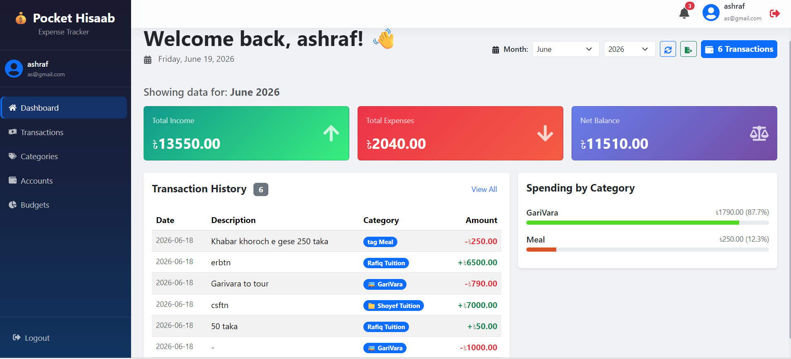
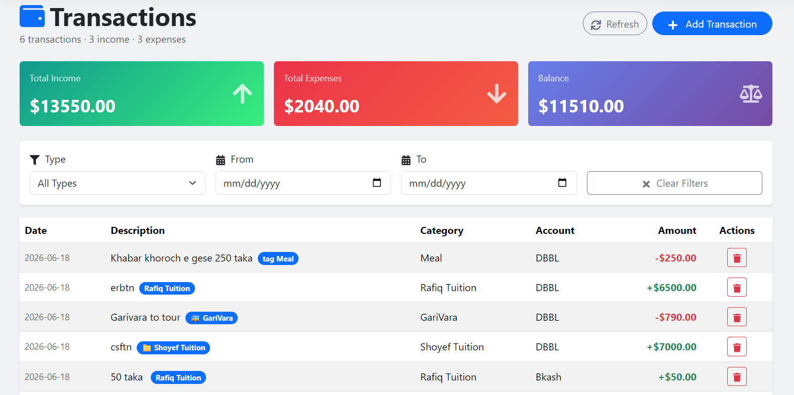
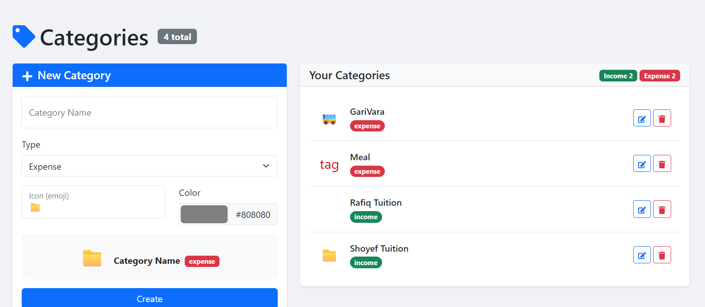

```markdown
# 💰 Pocket Hisaab – An Expense Tracker App

**Pocket Hisaab** is a full‑stack expense tracking application built with **FastAPI** (backend), **React** (web frontend), and **Flutter** (mobile – planned).  
It helps users manage daily expenses, monthly income, budgets, and accounts with a clean, professional dashboard.



---

## 🚀 Live Demo (Coming Soon)
- **Web App:** [https://pocket-hisaab.vercel.app](https://pocket-hisaab.vercel.app) *(once deployed)*
- **API Docs:** [https://pocket-hisaab-api.onrender.com/docs](https://pocket-hisaab-api.onrender.com/docs) *(once deployed)*

---

## ✨ Key Features

### 🧾 Transactions
- Add, view, and delete income/expense entries
- Filter by date range and transaction type
- Auto‑update account balance on every transaction

### 📊 Dashboard
- Real‑time summary of total income, expenses, and net balance
- Spending breakdown by category (with progress bars)
- Recent transaction history

### 🗂️ Categories & Accounts
- Create custom income/expense categories with icons & colours
- Manage multiple accounts (Cash, Bank, Credit Card)
- Track account‑wise balances

### 💰 Budgets
- Set monthly/yearly budgets per category
- Visual progress tracking with percentage indicators

### 🔐 Authentication
- Secure JWT‑based login & registration
- Password hashing with bcrypt
- Protected routes (frontend & backend)

---

## 🛠️ Tech Stack

| Layer        | Technology                                                                 |
|--------------|----------------------------------------------------------------------------|
| **Backend**  | FastAPI, SQLAlchemy, Pydantic, SQLite (dev) / PostgreSQL (prod), JWT, bcrypt |
| **Web Frontend** | React, React Router, Bootstrap, React Icons, Recharts, Axios, React Hot Toast |
| **Mobile**   | Flutter *(in progress)*                                                    |
| **Deployment** | Render / Railway (backend), Vercel / Netlify (frontend)                   |

---

## 📂 Project Structure

### Backend (FastAPI)

```
backend/
├── app/
│   ├── routers/
│   │   ├── __init__.py
│   │   ├── accounts.py
│   │   ├── auth.py
│   │   ├── budgets.py
│   │   ├── categories.py
│   │   ├── reports.py
│   │   ├── transactions.py
│   │   └── users.py
│   ├── __init__.py
│   ├── auth.py
│   ├── database.py
│   ├── dependencies.py
│   ├── models.py
│   └── schemas.py
├── venv/
├── .env
├── expense.db
└── requirements.txt
```

### Frontend (React)

```
frontend/
├── node_modules/
├── public/
├── src/
│   ├── api/
│   ├── assets/
│   ├── components/
│   ├── context/
│   ├── pages/
│   ├── App.css
│   ├── App.jsx
│   ├── custom.css
│   ├── index.css
│   └── main.jsx
├── .env
├── .gitignore
├── eslint.config.js
├── index.html
├── package-lock.json
├── package.json
├── README.md
└── vite.config.js
```

---

## 🖥️ Screenshots

| Dashboard | Transactions | Categories |
|:---------:|:------------:|:----------:|
|  |  |  |

> 💡 **More screenshots** will be added as the UI evolves.  
> Currently you can view the **dashboard**, **transactions list**, and **category management** pages.

---

## 🚀 Getting Started

### Prerequisites
- Python 3.10+ (backend)
- Node.js 18+ (frontend)

### 1. Clone the repository

```bash
git clone https://github.com/yourusername/Pocket-Hishaab-An-Expense-Tracker-App.git
cd Pocket-Hishaab-An-Expense-Tracker-App
```

### 2. Backend Setup

```bash
cd backend
python -m venv venv
source venv/bin/activate  # On Windows: venv\Scripts\activate
pip install -r requirements.txt
uvicorn app.main:app --reload
```

The backend will run at `http://localhost:8000`.  
API documentation: `http://localhost:8000/docs`

### 3. Frontend Setup

```bash
cd ../frontend
npm install
npm run dev
```

The web app will run at `http://localhost:5173`.

---

## 📡 API Endpoints Overview

| Method | Endpoint                 | Description                  |
|--------|--------------------------|------------------------------|
| POST   | `/auth/register`         | Register a new user          |
| POST   | `/auth/login`            | Login & get JWT token        |
| GET    | `/users/me`              | Get current user profile     |
| CRUD   | `/categories/`           | Manage categories            |
| CRUD   | `/accounts/`             | Manage accounts              |
| CRUD   | `/transactions/`         | Manage transactions          |
| CRUD   | `/budgets/`              | Manage budgets               |
| GET    | `/reports/dashboard`     | Dashboard summary            |

> Full API documentation is auto‑generated at `/docs` when the backend is running.

---

## 🧪 Testing

### Backend tests (planned)

```bash
cd backend
pytest
```

### Frontend tests (planned)

```bash
cd frontend
npm test
```

---

## 🚧 Future Improvements

- [ ] Mobile app with Flutter
- [ ] Export transactions as CSV/PDF
- [ ] Recurring transactions (daily/weekly/monthly)
- [ ] Multi‑currency support
- [ ] Dark mode
- [ ] Email notifications for budget alerts
- [ ] Docker containerisation

---

## 🤝 Contributing

Contributions, issues, and feature requests are welcome!  
Feel free to check the [issues page](https://github.com/yourusername/Pocket-Hishaab-An-Expense-Tracker-App/issues) if you want to help.

---

## 📄 License

This project is licensed under the **MIT License** – see the [LICENSE](LICENSE) file for details.

---

## 🙌 Acknowledgements

- Built with [FastAPI](https://fastapi.tiangolo.com/) – the modern Python web framework.
- UI powered by [React](https://react.dev/) & [Bootstrap](https://getbootstrap.com/).
- Icons from [React Icons](https://react-icons.github.io/react-icons/).

---

## 📬 Contact

**Ashraf** – [GitHub](https://github.com/ashraf1600)  
Project Link: [https://github.com/ashraf1600/Pocket-Hishaab-An-Expense-Tracker-App](https://github.com/ashraf1600/Pocket-Hishaab-An-Expense-Tracker-App)

---

> ⭐ If you like this project, please give it a star on GitHub! ⭐
```

---
